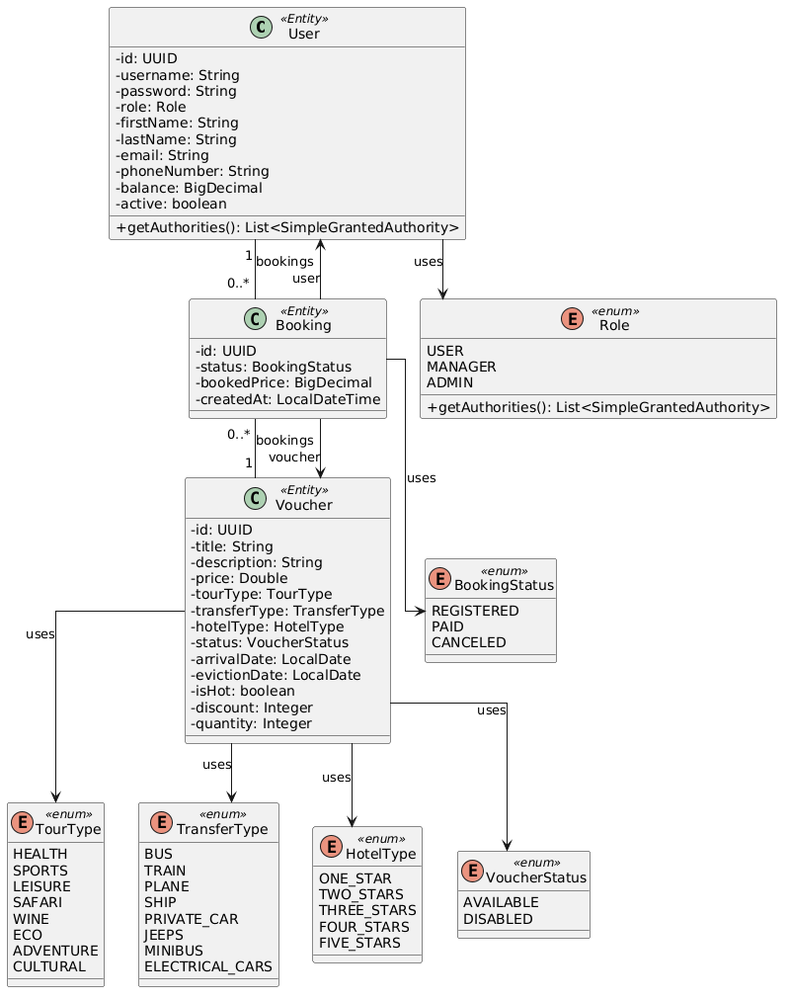
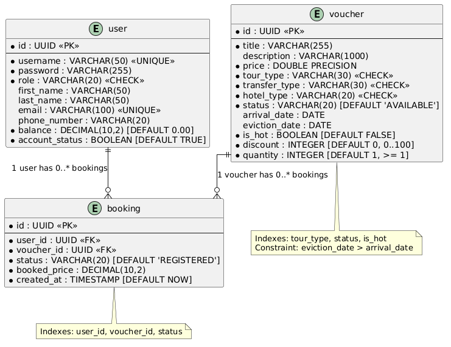

# TravelHub - Travel Agency Service

Spring Boot 3.4.4 web application for managing a travel agency with tour catalogue, booking system, and multi-role
access control. Features both a Thymeleaf MVC frontend and a REST API with JWT authentication.

## Tech Stack

- **Backend:** Spring Boot 3.4.4, Spring Security, Spring Data JPA
- **Frontend:** Thymeleaf, Bootstrap 5
- **Database:** PostgreSQL (prod), H2 (dev/test)
- **Auth:** Session-based (web) + JWT (API) + Google OAuth2
- **API Docs:** Swagger / OpenAPI 3.0
- **Deployment:** Docker, AWS EC2, GitHub Actions CI/CD
- **Other:** Lombok, AOP logging, i18n (EN/UK)

## Domain Model

The domain consists of three entities: **User**, **Voucher**, and **Booking** (join entity with status tracking and
price snapshot).



### Entities

| Entity      | Description                                                                                 |
|-------------|---------------------------------------------------------------------------------------------|
| **User**    | Profile, balance, role (USER/MANAGER/ADMIN). Implements `UserDetails` for Spring Security.  |
| **Voucher** | Tour product with type, transfer, hotel, dates, price, discount, quantity, hot flag.        |
| **Booking** | Links User to Voucher. Tracks status (REGISTERED/PAID/CANCELED) and `bookedPrice` snapshot. |

### Enums

| Enum          | Values                                                                |
|---------------|-----------------------------------------------------------------------|
| Role          | USER, MANAGER, ADMIN                                                  |
| TourType      | HEALTH, SPORTS, LEISURE, SAFARI, WINE, ECO, ADVENTURE, CULTURAL       |
| TransferType  | BUS, TRAIN, PLANE, SHIP, PRIVATE_CAR, JEEPS, MINIBUS, ELECTRICAL_CARS |
| HotelType     | ONE_STAR, TWO_STARS, THREE_STARS, FOUR_STARS, FIVE_STARS              |
| VoucherStatus | AVAILABLE, DISABLED                                                   |
| BookingStatus | REGISTERED, PAID, CANCELED                                            |

## ER Diagram (Database Schema)

Three tables: `user`, `voucher`, `booking`. Schema defined in `schema.sql` with CHECK constraints, indexes, and foreign
keys.



### Key Constraints

- `user.balance >= 0`, `voucher.price > 0`, `voucher.discount` between 0-100
- `voucher.eviction_date > voucher.arrival_date`
- `booking.user_id` and `booking.voucher_id` are foreign keys
- Indexes on: `voucher(tour_type, status, is_hot)`, `booking(user_id, voucher_id, status)`

## Role Permissions

| Feature                     | USER | MANAGER | ADMIN |
|-----------------------------|:----:|:-------:|:-----:|
| Browse catalogue            |  V   |    V    |   V   |
| Order/cancel own vouchers   |  V   |    V    |   V   |
| Top up balance              |  V   |    V    |   V   |
| Edit profile                |  V   |    V    |   V   |
| Create/edit/delete vouchers |      |    V    |   V   |
| Manage booking statuses     |      |    V    |   V   |
| View all orders             |      |    V    |   V   |
| Block/unblock users         |      |         |   V   |
| Change user roles           |      |         |   V   |
| Reset user passwords        |      |         |   V   |
| View dashboard stats        |      |         |   V   |

## Security Architecture

Two independent `SecurityFilterChain` instances:

| Chain         | Scope           | Auth                | Session       | CSRF     | Errors     |
|---------------|-----------------|---------------------|---------------|----------|------------|
| API (Order 1) | `/api/**`       | JWT Bearer token    | Stateless     | Disabled | JSON       |
| Web (Order 2) | Everything else | Form login + OAuth2 | Session-based | Enabled  | HTML pages |

Additional filters:

- **JwtAuthenticationFilter** - extracts/validates JWT on API requests
- **BlockedUserFilter** - checks in-memory cache of blocked users per web request

## REST API

Swagger UI available at `/swagger-ui.html` after starting the app.

| Method | Endpoint                | Auth   | Description                         |
|--------|-------------------------|--------|-------------------------------------|
| POST   | `/api/v1/auth/login`    | Public | Get JWT token                       |
| GET    | `/api/v1/vouchers`      | Public | Paginated voucher list with filters |
| GET    | `/api/v1/vouchers/{id}` | Public | Single voucher details              |

API errors return JSON: `{"status": 404, "error": "...", "timestamp": "..."}`.

## Project Structure

```
src/main/java/com/epam/finaltask/
  config/          Security, JWT, OAuth2, WebMvc, Swagger, AppProperties
  controller/      MVC controllers (Auth, Catalogue, User, Manager, Admin)
  controller/api/  REST controllers (ApiAuth, ApiVoucher)
  dto/             request/, response/, api/ - DTOs separated by purpose
  exception/       Custom exceptions + GlobalExceptionHandler (HTML) + ApiExceptionHandler (JSON)
  model/           JPA entities (User, Voucher, Booking) + enums
  repository/      Spring Data JPA repos + Specification classes for filtering
  service/         Service interfaces + impl/ with business logic
  validation/      Custom validators (@StrongPassword, @PasswordMatch, @DateRange)
  util/            PathConstants, ErrorConstants
  aspect/          AOP LoggingAspect
```

## Requirements

### Required

| Requirement                               | Implementation                                                                                                                                                                                                                                                                                                                                                                                                                                                                                                   |
|-------------------------------------------|------------------------------------------------------------------------------------------------------------------------------------------------------------------------------------------------------------------------------------------------------------------------------------------------------------------------------------------------------------------------------------------------------------------------------------------------------------------------------------------------------------------|
| **Spring Data JPA**                       | JPA entities with UUID primary keys, `JpaRepository` + `JpaSpecificationExecutor` for dynamic filtering, `@EntityGraph` to solve N+1, batch queries for available quantity calculation, `@Transactional` on service methods.                                                                                                                                                                                                                                                                                     |
| **Spring Security**                       | Two `SecurityFilterChain` instances (API + Web), `DaoAuthenticationProvider` with BCrypt, Google OAuth2 login, JWT token generation/validation, `@PreAuthorize` method-level security, custom `BlockedUserFilter` with scheduled cache refresh.                                                                                                                                                                                                                                                                  |
| **Internationalization and Localization** | Two languages (EN, UK) with ~260 message keys each. `SessionLocaleResolver` with `?lang=` parameter switching. `MessageSource` wired into bean validation. Thymeleaf `#{key}` syntax. Default locale: Ukrainian.                                                                                                                                                                                                                                                                                                 |
| **Validation**                            | Bean Validation (`@NotBlank`, `@Size`, `@Email`, `@DecimalMin`, `@DecimalMax`, `@Future`, `@Positive`). Custom validators: `@StrongPassword` (configurable min length + complexity), `@PasswordMatch` (cross-field confirmation via `PasswordConfirmable` interface), `@DateRange` (class-level date comparison). Business validation in services (duplicate username/email, balance, quantity). All validation messages are localized.                                                                          |
| **Error handling**                        | `GlobalExceptionHandler` (`@ControllerAdvice`) returns Thymeleaf error pages (400/403/404/500) for MVC. `ApiExceptionHandler` (`@RestControllerAdvice`) returns JSON for REST API. Security-level errors (401/403) handled via custom `authenticationEntryPoint`/`accessDeniedHandler` in SecurityConfig. Exception hierarchy: `ResourceNotFoundException` (parent) -> `UserNotFoundException`, `VoucherNotFoundException`, `BookingNotFoundException`. `LocalizedException` interface for i18n business errors. |

### Nice to Have

| Requirement                   | Implementation                                                                                                                                                                                                                                                                                                                                                        |
|-------------------------------|-----------------------------------------------------------------------------------------------------------------------------------------------------------------------------------------------------------------------------------------------------------------------------------------------------------------------------------------------------------------------|
| **Logging**                   | AOP-based `LoggingAspect`: `@Before` logs entry with args (DEBUG), `@AfterReturning` logs exit (DEBUG), `@AfterThrowing` logs exceptions (ERROR), `@Around` on business methods logs events (INFO/WARN). `SecurityEventListener` for login success/failure. Profile-specific config: test = DEBUG console, prod = INFO console + rolling file (30 days).              |
| **Pagination and sorting**    | All list pages paginated via `Page<DTO>`. Configurable page sizes per context via `AppProperties` (catalogue=9, manager=10, admin=15, API=20). JPA Specifications for dynamic filtering on 4 pages: catalogue (7 filters), manager vouchers (3 filters), manager orders (3 filters), admin users (4 filters including email search). Sort by price/discount/hot flag. |
| **Other Spring technologies** | Spring AOP (logging aspect), `@ConfigurationProperties` (typed config via `AppProperties`), `@Scheduled` (blocked user cache refresh), Spring Profiles (test/prod with separate DB and data), `@EntityGraph` (N+1 prevention), custom `ConstraintValidator` implementations.                                                                                          |
| **Swagger API**               | `springdoc-openapi` with Swagger UI at `/swagger-ui.html`. `SwaggerConfig` adds JWT Bearer auth scheme. `@Operation`, `@Parameter`, `@Tag` annotations on API controllers. Typed DTOs (`ApiLoginDTO`, `ApiTokenDTO`) for proper request/response schemas.                                                                                                             |
| **Thymeleaf**                 | Server-side rendering with fragment-based layout (navbar, footer, scripts). Role-based navigation via `sec:authorize`. Bootstrap 5 styling. Collapsible filter panels. Pagination with filter param preservation. `novalidate` forms with server-side validation + Bootstrap `is-invalid` styling. Locale-aware date formatting via `#temporals`.                     |

### Extra Functionality (beyond requirements)

| Feature | Description |
|---------|-------------|
| **Google OAuth2 Login** | Full OAuth2 flow with `OAuth2UserService` — auto-creates users from Google profile, coexists with form login in the same session-based security chain. |
| **HTTPS** | Self-signed PKCS12 certificate via `keytool`, `server.port=8443`. Docker maps 443->8443 in production. |
| **REST API alongside MVC** | Dual presentation layer — Thymeleaf HTML for browser users, REST JSON (`/api/v1/`) for third-party integrations. Two independent `SecurityFilterChain` instances with different auth strategies (session vs JWT). |
| **Swagger / OpenAPI** | `springdoc-openapi` with Swagger UI at `/swagger-ui.html`. JWT Bearer auth scheme for testing protected endpoints. Typed DTOs (`ApiLoginDTO`, `ApiTokenDTO`) for proper request/response schemas. |
| **Blocked User Filter** | Real-time mid-session enforcement via `OncePerRequestFilter`. In-memory `ConcurrentHashMap` cache with `@Scheduled` refresh (configurable interval). Immediate eviction on admin block action. |
| **AOP Logging** | `LoggingAspect` with `@Before`/`@AfterReturning`/`@AfterThrowing`/`@Around`. `SecurityEventListener` for login success/failure. Profile-specific config: DEBUG console (test), INFO + rolling file with 30-day retention (prod). |
| **Admin Dashboard** | Stats page with 6 clickable metric cards (total users, active users, available vouchers, registered/paid/canceled orders) — each links to the relevant management page with pre-applied filter. |
| **Docker + CI/CD** | Multi-stage Dockerfile (Maven build + JRE runtime). `docker-compose.prod.yml` with PostgreSQL + health checks. GitHub Actions pipeline for automated deployment to AWS EC2. |
| **Password Reset** | Admin can reset any user's password to a configurable default (`app.security.default-password`) via BCrypt encoding. Self-reset prevented by `validateNotSelf()`. |
| **Self-Protection** | Admin cannot block, demote, or reset password for their own account — `validateNotSelf()` throws `AccessDeniedException`. |
| **N+1 Prevention** | `@EntityGraph(attributePaths = {"user", "voucher"})` on booking queries. Batch `countActiveBookingsByVoucherIds` with GROUP BY replaces per-voucher queries (2 queries per page instead of N+1). |
| **Dual Exception Handling** | `GlobalExceptionHandler` returns Thymeleaf HTML error pages for MVC. `ApiExceptionHandler` returns JSON for REST API. Security-level 401/403 handled via custom `authenticationEntryPoint`/`accessDeniedHandler` with `ObjectMapper`. |
| **Configurable Properties** | `AppProperties` with `@ConfigurationProperties` — typed config for security (JWT expiry, password policy, cache interval) and pagination (per-context page sizes). No scattered `@Value` annotations. |

## Running

### Prerequisites

- Java 17+
- Maven 3.9+
- PostgreSQL 16 (or use H2 for dev)

### Local (H2)

```bash
mvn spring-boot:run
```

App starts at `https://localhost:8443`. Default test users are seeded via `data-h2.sql`.

### Docker (PostgreSQL)

```bash
docker compose -f docker-compose.prod.yml up --build
```

Requires `.env` file with: `DB_USERNAME`, `DB_PASSWORD`, `JWT_SECRET`, `SSL_KEY_STORE_PASSWORD`, `GOOGLE_CLIENT_ID`,
`GOOGLE_CLIENT_SECRET`.

### Tests

```bash
mvn test
```

120 tests: unit (services — 73), controller (@WebMvcTest — 46), and integration (@SpringBootTest — 1).

## Internationalization

Two languages: English (en) and Ukrainian (uk, default). Switch via `?lang=en` or `?lang=uk` query parameter. ~260
message keys per language covering UI, validation errors, and business messages.
